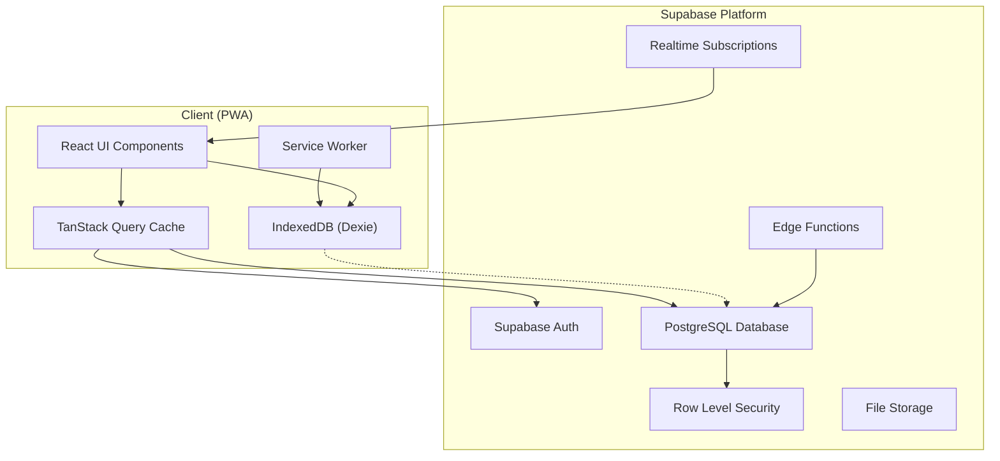
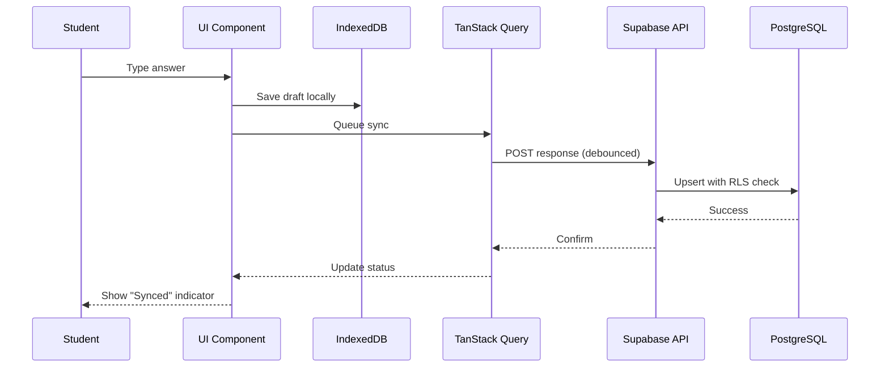
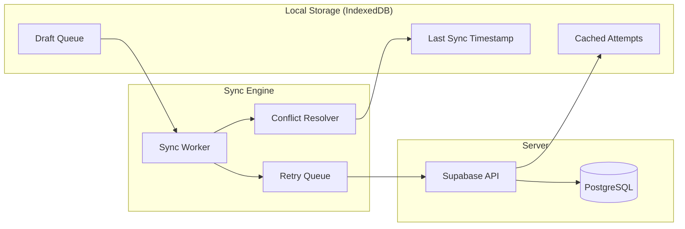

# Architecture Documentation

## Periodic Test Peer Evaluation App

### Overview

This application is a Progressive Web Application (PWA) designed for MBBS periodic tests with blinded peer evaluation. It supports three user roles: Students, Peer Evaluators (students evaluating others), and Faculty/Admin.

### Tech Stack Justification

| Technology | Choice | Justification |
|------------|--------|---------------|
| **Frontend Framework** | Next.js 14 (App Router) | Server components, streaming, built-in API routes, excellent TypeScript support |
| **Language** | TypeScript | Type safety, better DX, reduced runtime errors |
| **Styling** | TailwindCSS + shadcn/ui | Utility-first, consistent design system, accessible components |
| **State Management** | TanStack Query | Server state caching, automatic refetching, optimistic updates |
| **Forms** | React Hook Form + Zod | Performance, validation, TypeScript integration |
| **Backend/Auth** | Supabase | Postgres, Auth, RLS, Realtime, Storage - all-in-one |
| **PWA** | next-pwa + Workbox | Mature PWA solution with offline caching |
| **Offline Storage** | Dexie (IndexedDB) | Full-featured IndexedDB wrapper with sync support |
| **Testing** | Vitest + Playwright | Fast unit tests, reliable e2e testing |

### System Architecture



### Data Flow Architecture



### Allocation Algorithm Design

**Decision: Immediate allocation on submission**

Rationale:
1. Students can start evaluating immediately after submission window
2. Reduces waiting time for evaluation phase
3. Simpler implementation with real-time allocation
4. Better UX for evaluators who complete tests early

**Algorithm (Fisher-Yates based with constraints):**

```
function allocatePeers(submission, allSubmissions, config):
    eligible = filter(allSubmissions, s => 
        s.id != submission.student_id AND
        s.batch == submission.batch (if sameSection) AND
        !recentlyPaired(s.id, submission.student_id, config.horizon)
    )
    
    // Sort by current assignment load (ascending)
    eligible.sort(e => getAssignmentCount(e.id))
    
    // Select N evaluators with minimum load
    evaluators = eligible.slice(0, config.evaluatorsPerSubmission)
    
    // Create allocations
    for each evaluator in evaluators:
        createAllocation(submission.attempt_id, evaluator.id)
    
    return allocations
```

### Route Structure

```
/                           → Landing/redirect
├── /auth
│   ├── /login              → Unified login page
│   ├── /signup             → Student self-registration (if enabled)
│   └── /reset-password    → Password reset
│
├── /student
│   ├── /dashboard          → Test overview, status, scores
│   ├── /tests
│   │   ├── /[testId]       → Test details/instructions
│   │   └── /[testId]/attempt → Test-taking interface
│   ├── /evaluations
│   │   ├── /pending        → Assigned evaluations list
│   │   └── /[allocationId] → Evaluation form
│   ├── /results
│   │   └── /[attemptId]    → My results (blinded evaluator)
│   └── /profile            → Profile view/edit
│
├── /admin
│   ├── /dashboard          → Overview stats, quick actions
│   ├── /tests
│   │   ├── /               → Test list
│   │   ├── /create         → Create/import test
│   │   ├── /[testId]       → Test details
│   │   ├── /[testId]/edit  → Edit test
│   │   └── /[testId]/submissions → All submissions
│   ├── /users
│   │   ├── /               → User list, bulk import
│   │   └── /[userId]       → User details
│   ├── /analytics
│   │   ├── /               → Overview dashboards
│   │   ├── /leaderboard    → Rankings
│   │   └── /item-analysis  → MCQ analytics
│   ├── /evaluations        → All evaluations overview
│   └── /audit-logs         → System logs
│
└── /api
    ├── /auth/...           → Auth endpoints
    ├── /tests/...          → Test CRUD
    ├── /attempts/...       → Attempt management
    ├── /allocations/...    → Allocation trigger
    ├── /evaluations/...    → Evaluation submission
    ├── /admin/...          → Admin-only operations
    └── /ai/...             → AI hook endpoints (scaffolded)
```

### Offline Sync Strategy



**Conflict Resolution: Last-Write-Wins with Timestamps**
- Each response has a `saved_at` timestamp
- Server accepts update only if `incoming.saved_at > stored.saved_at`
- Client shows conflict UI if server rejects (rare edge case)

### Security Architecture

1. **Authentication**: Supabase Auth with email/password
2. **Authorization**: RLS policies on all tables
3. **Secrets**: All API keys in env vars, never in client
4. **Service Role**: Only used in Edge Functions/API routes
5. **Rate Limiting**: Supabase built-in + custom middleware
6. **Audit Logs**: All significant actions logged to `audit_logs` table
7. **Input Validation**: Zod schemas on client + server
8. **XSS Prevention**: React's built-in escaping + CSP headers
9. **CSRF**: Supabase handles via JWT tokens

### Performance Considerations

1. **Code Splitting**: Next.js automatic per-route
2. **Image Optimization**: Next.js Image component
3. **Caching**: TanStack Query with stale-while-revalidate
4. **Database**: Indexes on frequently queried columns
5. **Pagination**: Cursor-based for large datasets
6. **Compression**: Gzip/Brotli via Vercel/Netlify
