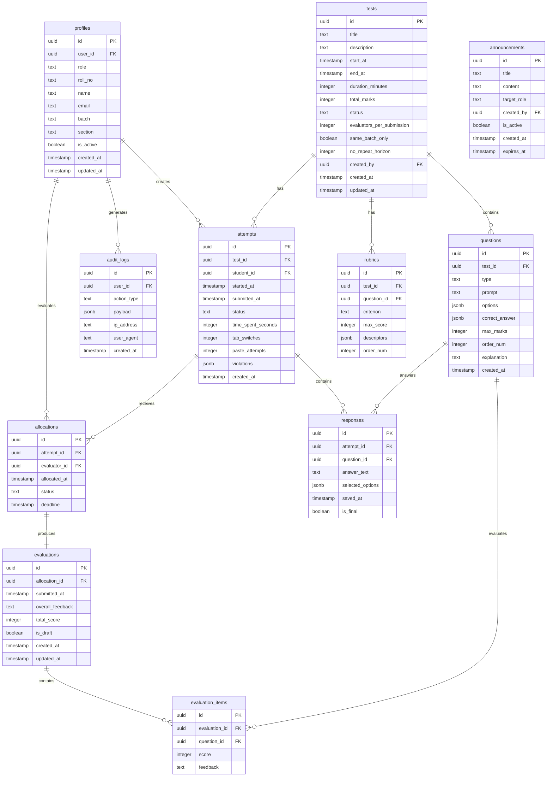

# Database Schema Documentation

## Entity Relationship Diagram



## Table Definitions

### 1. profiles
Extends Supabase auth.users with application-specific data.

| Column | Type | Constraints | Description |
|--------|------|-------------|-------------|
| id | uuid | PK, DEFAULT gen_random_uuid() | Primary key |
| user_id | uuid | FK → auth.users(id), UNIQUE, NOT NULL | Reference to auth user |
| role | text | NOT NULL, CHECK (role IN ('student', 'admin', 'faculty')) | User role |
| roll_no | text | UNIQUE | Student roll number |
| name | text | NOT NULL | Full name |
| email | text | NOT NULL | Email address |
| batch | text | | Batch/year (e.g., "2023") |
| section | text | | Section (e.g., "A") |
| is_active | boolean | DEFAULT true | Account status |
| created_at | timestamptz | DEFAULT now() | Creation timestamp |
| updated_at | timestamptz | DEFAULT now() | Last update |

### 2. tests
Stores periodic test configurations.

| Column | Type | Constraints | Description |
|--------|------|-------------|-------------|
| id | uuid | PK, DEFAULT gen_random_uuid() | Primary key |
| title | text | NOT NULL | Test title |
| description | text | | Test description/instructions |
| start_at | timestamptz | NOT NULL | Test window start |
| end_at | timestamptz | NOT NULL | Test window end |
| duration_minutes | integer | NOT NULL | Time limit in minutes |
| total_marks | integer | NOT NULL | Total possible marks |
| status | text | DEFAULT 'draft', CHECK (status IN ('draft', 'published', 'active', 'closed', 'archived')) | Test status |
| evaluators_per_submission | integer | DEFAULT 1 | Number of peer evaluators per submission |
| same_batch_only | boolean | DEFAULT true | Restrict evaluation to same batch |
| no_repeat_horizon | integer | DEFAULT 3 | Tests within which same pair avoided |
| eval_start_at | timestamptz | | Evaluation window start |
| eval_end_at | timestamptz | | Evaluation window end |
| created_by | uuid | FK → profiles(id), NOT NULL | Admin who created |
| created_at | timestamptz | DEFAULT now() | Creation timestamp |
| updated_at | timestamptz | DEFAULT now() | Last update |

### 3. questions
Individual questions within a test.

| Column | Type | Constraints | Description |
|--------|------|-------------|-------------|
| id | uuid | PK, DEFAULT gen_random_uuid() | Primary key |
| test_id | uuid | FK → tests(id) ON DELETE CASCADE, NOT NULL | Parent test |
| type | text | NOT NULL, CHECK (type IN ('mcq_single', 'mcq_multi', 'short', 'long')) | Question type |
| prompt | text | NOT NULL | Question text |
| options | jsonb | | Options for MCQ: [{id, text}] |
| correct_answer | jsonb | | Correct answer(s) for auto-grading |
| max_marks | integer | NOT NULL | Maximum marks for this question |
| order_num | integer | NOT NULL | Display order |
| explanation | text | | Explanation (shown after test) |
| created_at | timestamptz | DEFAULT now() | Creation timestamp |

### 4. rubrics
Optional detailed rubrics for evaluation.

| Column | Type | Constraints | Description |
|--------|------|-------------|-------------|
| id | uuid | PK, DEFAULT gen_random_uuid() | Primary key |
| test_id | uuid | FK → tests(id) ON DELETE CASCADE | Parent test |
| question_id | uuid | FK → questions(id) ON DELETE CASCADE | Specific question (nullable for test-level) |
| criterion | text | NOT NULL | Rubric criterion name |
| max_score | integer | NOT NULL | Maximum score for this criterion |
| descriptors | jsonb | | Score level descriptions |
| order_num | integer | NOT NULL | Display order |

### 5. attempts
Student test attempts.

| Column | Type | Constraints | Description |
|--------|------|-------------|-------------|
| id | uuid | PK, DEFAULT gen_random_uuid() | Primary key |
| test_id | uuid | FK → tests(id), NOT NULL | Test being attempted |
| student_id | uuid | FK → profiles(id), NOT NULL | Student making attempt |
| started_at | timestamptz | DEFAULT now() | When attempt started |
| submitted_at | timestamptz | | When attempt was submitted |
| status | text | DEFAULT 'in_progress', CHECK (status IN ('in_progress', 'submitted', 'evaluated', 'reopened')) | Attempt status |
| time_spent_seconds | integer | DEFAULT 0 | Total time spent |
| tab_switches | integer | DEFAULT 0 | Tab switch violation count |
| paste_attempts | integer | DEFAULT 0 | Paste attempt count |
| violations | jsonb | DEFAULT '[]' | Detailed violation log |
| created_at | timestamptz | DEFAULT now() | Creation timestamp |

### 6. responses
Individual question responses.

| Column | Type | Constraints | Description |
|--------|------|-------------|-------------|
| id | uuid | PK, DEFAULT gen_random_uuid() | Primary key |
| attempt_id | uuid | FK → attempts(id) ON DELETE CASCADE, NOT NULL | Parent attempt |
| question_id | uuid | FK → questions(id), NOT NULL | Question answered |
| answer_text | text | | Text answer (for short/long) |
| selected_options | jsonb | | Selected option IDs (for MCQ) |
| saved_at | timestamptz | DEFAULT now() | Last save timestamp |
| is_final | boolean | DEFAULT false | Locked after submission |

### 7. allocations
Peer evaluation assignments.

| Column | Type | Constraints | Description |
|--------|------|-------------|-------------|
| id | uuid | PK, DEFAULT gen_random_uuid() | Primary key |
| attempt_id | uuid | FK → attempts(id), NOT NULL | Submission to evaluate |
| evaluator_id | uuid | FK → profiles(id), NOT NULL | Assigned evaluator |
| allocated_at | timestamptz | DEFAULT now() | When allocated |
| status | text | DEFAULT 'pending', CHECK (status IN ('pending', 'in_progress', 'completed', 'expired')) | Evaluation status |
| deadline | timestamptz | | Evaluation deadline |

### 8. evaluations
Completed peer evaluations.

| Column | Type | Constraints | Description |
|--------|------|-------------|-------------|
| id | uuid | PK, DEFAULT gen_random_uuid() | Primary key |
| allocation_id | uuid | FK → allocations(id), UNIQUE, NOT NULL | Source allocation |
| submitted_at | timestamptz | | When submitted |
| overall_feedback | text | | General feedback |
| total_score | integer | | Calculated total score |
| is_draft | boolean | DEFAULT true | Draft or final |
| created_at | timestamptz | DEFAULT now() | Creation timestamp |
| updated_at | timestamptz | DEFAULT now() | Last update |

### 9. evaluation_items
Per-question evaluation scores.

| Column | Type | Constraints | Description |
|--------|------|-------------|-------------|
| id | uuid | PK, DEFAULT gen_random_uuid() | Primary key |
| evaluation_id | uuid | FK → evaluations(id) ON DELETE CASCADE, NOT NULL | Parent evaluation |
| question_id | uuid | FK → questions(id), NOT NULL | Question evaluated |
| score | integer | NOT NULL | Score given |
| feedback | text | | Question-specific feedback |

### 10. audit_logs
System audit trail.

| Column | Type | Constraints | Description |
|--------|------|-------------|-------------|
| id | uuid | PK, DEFAULT gen_random_uuid() | Primary key |
| user_id | uuid | FK → profiles(id) | User who performed action |
| action_type | text | NOT NULL | Action category |
| payload | jsonb | DEFAULT '{}' | Action details |
| ip_address | text | | Client IP |
| user_agent | text | | Client user agent |
| created_at | timestamptz | DEFAULT now() | When action occurred |

### 11. announcements
Admin announcements panel.

| Column | Type | Constraints | Description |
|--------|------|-------------|-------------|
| id | uuid | PK, DEFAULT gen_random_uuid() | Primary key |
| title | text | NOT NULL | Announcement title |
| content | text | NOT NULL | Announcement body |
| target_role | text | | Target audience (null = all) |
| created_by | uuid | FK → profiles(id), NOT NULL | Author |
| is_active | boolean | DEFAULT true | Show/hide status |
| created_at | timestamptz | DEFAULT now() | Creation timestamp |
| expires_at | timestamptz | | Auto-hide after this time |

## Views

### anonymized_submissions_view
For peer evaluators - strips identifying information.

```sql
CREATE VIEW anonymized_submissions_view AS
SELECT 
    al.id as allocation_id,
    al.evaluator_id,
    al.status as allocation_status,
    al.deadline,
    a.id as attempt_id,
    a.test_id,
    t.title as test_title,
    t.total_marks,
    -- Anonymized identifier
    'Submission-' || SUBSTRING(a.id::text, 1, 8) as submission_code,
    a.submitted_at
FROM allocations al
JOIN attempts a ON al.attempt_id = a.id
JOIN tests t ON a.test_id = t.id
WHERE a.status = 'submitted';
```

### evaluation_results_view
For students - shows their evaluation results without evaluator identity.

```sql
CREATE VIEW evaluation_results_view AS
SELECT 
    a.id as attempt_id,
    a.student_id,
    a.test_id,
    e.total_score,
    e.overall_feedback,
    e.submitted_at as evaluated_at,
    -- No evaluator_id exposed
    ei.question_id,
    ei.score as question_score,
    ei.feedback as question_feedback
FROM attempts a
JOIN allocations al ON al.attempt_id = a.id
JOIN evaluations e ON e.allocation_id = al.id
LEFT JOIN evaluation_items ei ON ei.evaluation_id = e.id
WHERE e.is_draft = false;
```

## Indexes

```sql
-- Performance indexes
CREATE INDEX idx_attempts_student ON attempts(student_id);
CREATE INDEX idx_attempts_test ON attempts(test_id);
CREATE INDEX idx_attempts_status ON attempts(status);
CREATE INDEX idx_responses_attempt ON responses(attempt_id);
CREATE INDEX idx_allocations_evaluator ON allocations(evaluator_id);
CREATE INDEX idx_allocations_attempt ON allocations(attempt_id);
CREATE INDEX idx_evaluations_allocation ON evaluations(allocation_id);
CREATE INDEX idx_audit_logs_user ON audit_logs(user_id);
CREATE INDEX idx_audit_logs_action ON audit_logs(action_type);
CREATE INDEX idx_audit_logs_created ON audit_logs(created_at DESC);
CREATE INDEX idx_questions_test ON questions(test_id);
CREATE INDEX idx_tests_status ON tests(status);
CREATE INDEX idx_tests_dates ON tests(start_at, end_at);
CREATE INDEX idx_profiles_role ON profiles(role);
CREATE INDEX idx_profiles_batch ON profiles(batch);
```

## Functions

### allocate_peer_evaluators
Stored procedure for peer allocation (SECURITY DEFINER).

```sql
CREATE OR REPLACE FUNCTION allocate_peer_evaluators(attempt_uuid UUID)
RETURNS SETOF allocations
LANGUAGE plpgsql
SECURITY DEFINER
AS $$
-- See full implementation in migrations
$$;
```

### calculate_evaluator_metrics
Calculates evaluator leniency and reliability scores.

```sql
CREATE OR REPLACE FUNCTION calculate_evaluator_metrics(evaluator_uuid UUID)
RETURNS TABLE(
    leniency_score DECIMAL,
    reliability_score DECIMAL,
    total_evaluations INTEGER
)
LANGUAGE plpgsql
SECURITY DEFINER
AS $$
-- See full implementation in migrations
$$;
```
