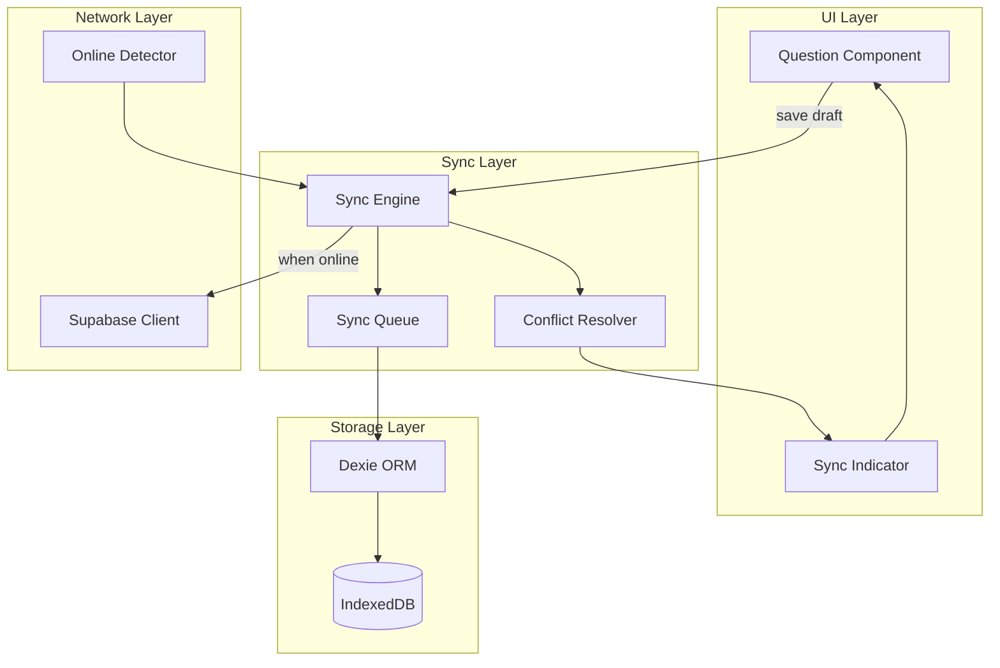

# Offline Sync Design

## Overview

The offline sync system ensures students can continue answering questions even when temporarily disconnected. Answers are saved locally and synchronized with the server when online.

## Architecture



## Storage Schema (IndexedDB via Dexie)

```typescript
// lib/offline/db.ts
import Dexie, { Table } from 'dexie';

interface DraftResponse {
  id: string;                    // `${attemptId}-${questionId}`
  attemptId: string;
  questionId: string;
  answerText?: string;
  selectedOptions?: string[];
  savedAt: number;               // Unix timestamp
  syncStatus: 'pending' | 'syncing' | 'synced' | 'error';
  syncError?: string;
  serverSavedAt?: number;        // Last known server timestamp
}

interface SyncQueueItem {
  id: string;
  operation: 'upsert' | 'submit';
  payload: any;
  createdAt: number;
  retryCount: number;
  lastError?: string;
}

interface AttemptCache {
  attemptId: string;
  testId: string;
  questions: any[];
  responses: any[];
  cachedAt: number;
}

class OfflineDatabase extends Dexie {
  draftResponses!: Table<DraftResponse>;
  syncQueue!: Table<SyncQueueItem>;
  attemptCache!: Table<AttemptCache>;
  
  constructor() {
    super('periodic-test-app');
    
    this.version(1).stores({
      draftResponses: 'id, attemptId, questionId, syncStatus',
      syncQueue: 'id, operation, createdAt',
      attemptCache: 'attemptId, testId'
    });
  }
}

export const db = new OfflineDatabase();
```

## Sync Engine

### Core Logic

```typescript
// lib/offline/sync-engine.ts
import { db } from './db';
import { supabase } from '@/lib/supabase/client';

export class SyncEngine {
  private isOnline: boolean = navigator.onLine;
  private isSyncing: boolean = false;
  private retryTimeout: NodeJS.Timeout | null = null;
  private listeners: Set<(status: SyncStatus) => void> = new Set();
  
  constructor() {
    // Monitor network status
    window.addEventListener('online', () => this.handleOnline());
    window.addEventListener('offline', () => this.handleOffline());
    
    // Start sync loop
    this.startSyncLoop();
  }
  
  private handleOnline() {
    this.isOnline = true;
    this.notifyListeners({ online: true, syncing: false });
    this.processQueue();
  }
  
  private handleOffline() {
    this.isOnline = false;
    this.notifyListeners({ online: false, syncing: false });
  }
  
  // Save draft locally first, then queue for sync
  async saveDraft(
    attemptId: string, 
    questionId: string, 
    answer: { text?: string; options?: string[] }
  ): Promise<DraftResponse> {
    const id = `${attemptId}-${questionId}`;
    const now = Date.now();
    
    const draft: DraftResponse = {
      id,
      attemptId,
      questionId,
      answerText: answer.text,
      selectedOptions: answer.options,
      savedAt: now,
      syncStatus: 'pending'
    };
    
    // Save to IndexedDB
    await db.draftResponses.put(draft);
    
    // Queue sync operation
    await this.queueSync({
      id: `sync-${id}-${now}`,
      operation: 'upsert',
      payload: {
        attemptId,
        questionId,
        answerText: answer.text,
        selectedOptions: answer.options,
        savedAt: new Date(now).toISOString()
      },
      createdAt: now,
      retryCount: 0
    });
    
    // Try immediate sync if online
    if (this.isOnline) {
      this.processQueue();
    }
    
    return draft;
  }
  
  // Load drafts - merge local and server data
  async loadDrafts(attemptId: string): Promise<Map<string, DraftResponse>> {
    const drafts = new Map<string, DraftResponse>();
    
    // Get local drafts
    const localDrafts = await db.draftResponses
      .where('attemptId')
      .equals(attemptId)
      .toArray();
    
    for (const draft of localDrafts) {
      drafts.set(draft.questionId, draft);
    }
    
    // Fetch server responses if online
    if (this.isOnline) {
      try {
        const { data: serverResponses } = await supabase
          .from('responses')
          .select('*')
          .eq('attempt_id', attemptId);
        
        if (serverResponses) {
          for (const resp of serverResponses) {
            const localDraft = drafts.get(resp.question_id);
            const serverTime = new Date(resp.saved_at).getTime();
            
            // Use server version if newer
            if (!localDraft || serverTime > localDraft.savedAt) {
              drafts.set(resp.question_id, {
                id: `${attemptId}-${resp.question_id}`,
                attemptId,
                questionId: resp.question_id,
                answerText: resp.answer_text,
                selectedOptions: resp.selected_options,
                savedAt: serverTime,
                syncStatus: 'synced',
                serverSavedAt: serverTime
              });
            }
          }
        }
      } catch (error) {
        console.warn('Failed to fetch server responses:', error);
      }
    }
    
    return drafts;
  }
  
  private async queueSync(item: SyncQueueItem) {
    await db.syncQueue.put(item);
  }
  
  private async processQueue() {
    if (this.isSyncing || !this.isOnline) return;
    
    this.isSyncing = true;
    this.notifyListeners({ online: true, syncing: true });
    
    try {
      const pending = await db.syncQueue
        .orderBy('createdAt')
        .toArray();
      
      for (const item of pending) {
        await this.processSyncItem(item);
      }
    } finally {
      this.isSyncing = false;
      this.notifyListeners({ online: true, syncing: false });
    }
  }
  
  private async processSyncItem(item: SyncQueueItem) {
    const draftId = item.payload.attemptId + '-' + item.payload.questionId;
    
    try {
      // Update draft status
      await db.draftResponses.update(draftId, { syncStatus: 'syncing' });
      
      // Upsert to server
      const { error } = await supabase
        .from('responses')
        .upsert({
          attempt_id: item.payload.attemptId,
          question_id: item.payload.questionId,
          answer_text: item.payload.answerText,
          selected_options: item.payload.selectedOptions,
          saved_at: item.payload.savedAt
        }, {
          onConflict: 'attempt_id,question_id',
          ignoreDuplicates: false
        });
      
      if (error) throw error;
      
      // Success - remove from queue, update draft status
      await db.syncQueue.delete(item.id);
      await db.draftResponses.update(draftId, { 
        syncStatus: 'synced',
        serverSavedAt: new Date(item.payload.savedAt).getTime()
      });
      
    } catch (error: any) {
      // Handle conflict: server has newer data
      if (error.code === '23505' || error.message?.includes('conflict')) {
        await this.handleConflict(draftId, item);
        return;
      }
      
      // Retry logic
      item.retryCount++;
      item.lastError = error.message;
      
      if (item.retryCount >= 5) {
        // Max retries reached
        await db.syncQueue.delete(item.id);
        await db.draftResponses.update(draftId, { 
          syncStatus: 'error',
          syncError: 'Max retries exceeded: ' + error.message
        });
      } else {
        // Update retry count and schedule retry
        await db.syncQueue.put(item);
        await db.draftResponses.update(draftId, { 
          syncStatus: 'pending',
          syncError: error.message
        });
        this.scheduleRetry();
      }
    }
  }
  
  private async handleConflict(draftId: string, item: SyncQueueItem) {
    // Fetch server version
    const { data: serverResp } = await supabase
      .from('responses')
      .select('*')
      .eq('attempt_id', item.payload.attemptId)
      .eq('question_id', item.payload.questionId)
      .single();
    
    if (!serverResp) return;
    
    const serverTime = new Date(serverResp.saved_at).getTime();
    const localTime = new Date(item.payload.savedAt).getTime();
    
    // Last-write-wins
    if (localTime > serverTime) {
      // Our version is newer, force update
      await supabase
        .from('responses')
        .update({
          answer_text: item.payload.answerText,
          selected_options: item.payload.selectedOptions,
          saved_at: item.payload.savedAt
        })
        .eq('attempt_id', item.payload.attemptId)
        .eq('question_id', item.payload.questionId);
    } else {
      // Server version is newer, update local
      await db.draftResponses.update(draftId, {
        answerText: serverResp.answer_text,
        selectedOptions: serverResp.selected_options,
        savedAt: serverTime,
        syncStatus: 'synced',
        serverSavedAt: serverTime
      });
    }
    
    // Remove from queue
    await db.syncQueue.delete(item.id);
  }
  
  private scheduleRetry() {
    if (this.retryTimeout) return;
    
    // Exponential backoff: 1s, 2s, 4s, 8s, 16s
    const delay = Math.min(1000 * Math.pow(2, 0), 16000);
    
    this.retryTimeout = setTimeout(() => {
      this.retryTimeout = null;
      this.processQueue();
    }, delay);
  }
  
  private startSyncLoop() {
    // Periodic sync every 30 seconds
    setInterval(() => {
      if (this.isOnline && !this.isSyncing) {
        this.processQueue();
      }
    }, 30000);
  }
  
  subscribe(listener: (status: SyncStatus) => void) {
    this.listeners.add(listener);
    return () => this.listeners.delete(listener);
  }
  
  private notifyListeners(status: SyncStatus) {
    this.listeners.forEach(l => l(status));
  }
}

export interface SyncStatus {
  online: boolean;
  syncing: boolean;
}

// Singleton instance
export const syncEngine = new SyncEngine();
```

## UI Integration

### Sync Status Indicator

```tsx
// components/SyncIndicator.tsx
'use client';

import { useEffect, useState } from 'react';
import { syncEngine, SyncStatus } from '@/lib/offline/sync-engine';
import { Cloud, CloudOff, RefreshCw, Check, AlertCircle } from 'lucide-react';

interface Props {
  questionId?: string;
  attemptId?: string;
}

export function SyncIndicator({ questionId, attemptId }: Props) {
  const [status, setStatus] = useState<SyncStatus>({ online: true, syncing: false });
  const [draftStatus, setDraftStatus] = useState<string>('synced');
  
  useEffect(() => {
    return syncEngine.subscribe(setStatus);
  }, []);
  
  useEffect(() => {
    if (questionId && attemptId) {
      // Watch specific draft status
      const checkStatus = async () => {
        const draft = await db.draftResponses.get(`${attemptId}-${questionId}`);
        if (draft) {
          setDraftStatus(draft.syncStatus);
        }
      };
      checkStatus();
      const interval = setInterval(checkStatus, 1000);
      return () => clearInterval(interval);
    }
  }, [questionId, attemptId]);
  
  if (!status.online) {
    return (
      <div className="flex items-center gap-1.5 text-yellow-600 text-sm">
        <CloudOff className="w-4 h-4" />
        <span>Offline - saving locally</span>
      </div>
    );
  }
  
  if (status.syncing || draftStatus === 'syncing') {
    return (
      <div className="flex items-center gap-1.5 text-blue-600 text-sm">
        <RefreshCw className="w-4 h-4 animate-spin" />
        <span>Syncing...</span>
      </div>
    );
  }
  
  if (draftStatus === 'error') {
    return (
      <div className="flex items-center gap-1.5 text-red-600 text-sm">
        <AlertCircle className="w-4 h-4" />
        <span>Sync error - will retry</span>
      </div>
    );
  }
  
  if (draftStatus === 'pending') {
    return (
      <div className="flex items-center gap-1.5 text-gray-500 text-sm">
        <Cloud className="w-4 h-4" />
        <span>Saved locally</span>
      </div>
    );
  }
  
  return (
    <div className="flex items-center gap-1.5 text-green-600 text-sm">
      <Check className="w-4 h-4" />
      <span>Saved to cloud</span>
    </div>
  );
}
```

### Question Editor Integration

```tsx
// Usage in question component
const QuestionEditor = ({ attemptId, question }) => {
  const [answer, setAnswer] = useState('');
  const debouncedSave = useDebouncedCallback(
    async (value: string) => {
      await syncEngine.saveDraft(attemptId, question.id, { text: value });
    },
    1000 // Save every 1 second after typing stops
  );
  
  // Also save on blur
  const handleBlur = async () => {
    await syncEngine.saveDraft(attemptId, question.id, { text: answer });
  };
  
  return (
    <div>
      <textarea
        value={answer}
        onChange={(e) => {
          setAnswer(e.target.value);
          debouncedSave(e.target.value);
        }}
        onBlur={handleBlur}
      />
      <SyncIndicator attemptId={attemptId} questionId={question.id} />
    </div>
  );
};
```

## Service Worker Integration

```javascript
// public/sw.js (partial)

// Background sync registration
self.addEventListener('sync', (event) => {
  if (event.tag === 'sync-responses') {
    event.waitUntil(syncResponses());
  }
});

async function syncResponses() {
  // Open IndexedDB directly in service worker
  const db = await openDB('periodic-test-app', 1);
  const pending = await db.getAll('syncQueue');
  
  for (const item of pending) {
    try {
      const response = await fetch('/api/responses/sync', {
        method: 'POST',
        headers: { 'Content-Type': 'application/json' },
        body: JSON.stringify(item.payload)
      });
      
      if (response.ok) {
        await db.delete('syncQueue', item.id);
      }
    } catch (error) {
      console.error('Background sync failed:', error);
    }
  }
}
```

## Testing Strategy

### Unit Tests

```typescript
// __tests__/sync-engine.test.ts
import { SyncEngine } from '@/lib/offline/sync-engine';
import { db } from '@/lib/offline/db';

describe('SyncEngine', () => {
  beforeEach(async () => {
    await db.delete();
    await db.open();
  });
  
  it('saves draft to IndexedDB', async () => {
    const engine = new SyncEngine();
    
    await engine.saveDraft('attempt-1', 'question-1', { text: 'My answer' });
    
    const draft = await db.draftResponses.get('attempt-1-question-1');
    expect(draft).toBeDefined();
    expect(draft?.answerText).toBe('My answer');
    expect(draft?.syncStatus).toBe('pending');
  });
  
  it('handles offline mode', async () => {
    // Simulate offline
    Object.defineProperty(navigator, 'onLine', { value: false });
    
    const engine = new SyncEngine();
    await engine.saveDraft('attempt-1', 'question-1', { text: 'Offline answer' });
    
    // Should be saved locally
    const draft = await db.draftResponses.get('attempt-1-question-1');
    expect(draft?.syncStatus).toBe('pending');
    
    // Queue should have item
    const queue = await db.syncQueue.toArray();
    expect(queue.length).toBe(1);
  });
});
```

## Metrics & Monitoring

Track sync health via analytics:

- Sync success rate
- Average sync latency
- Conflict frequency
- Offline session duration
- Data loss incidents (should be 0)

```typescript
// Track sync events
const trackSync = (event: string, data: any) => {
  if (typeof window !== 'undefined' && window.analytics) {
    window.analytics.track(event, data);
  }
};

// Usage in sync engine
trackSync('sync_completed', { duration: syncDuration, itemCount });
trackSync('sync_conflict', { resolution: 'server_wins' | 'client_wins' });
trackSync('sync_error', { error: error.message, retryCount });
```
